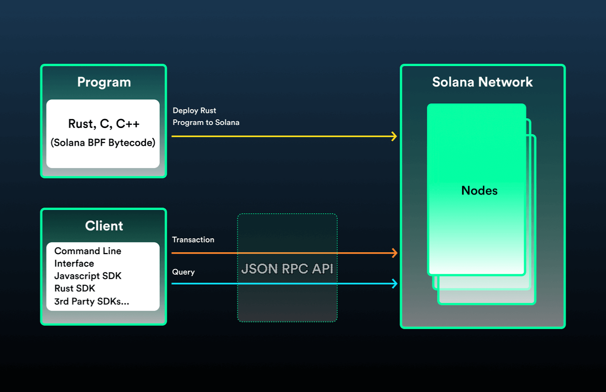

Solana 网络是一个庞大的全球计算机，任何人都可以支付费用来存储和执行代码。
Solana 上部署的代码被称为 程序，在其他区块链上通常被称为 智能合约。如果要与 程序 交互，就需要从客户端向区块链上发送一笔交易。
Solana 的开发流程可以用 程序-客户端（program-client）模型来表示。

### Program 程序开发
我们可以直接创建和部署自定义的 Rust, C 和 C++ 程序到 Solana 区块链。这些程序部署后，任何人都可以使用它们。
我们可以使用客户端 SDK（或 CLI）编写 DApps 来与这些程序通信，这些客户端 SDK 底层均使用了 JSON RPC API。
这部分工作通常也可以称为 合约开发。

### Client 客户端开发
我们可以编写与部署的与程序通信的去中心化应用 DApps，它们可以通过客户端 SDK 向程序提交交易指令。
最常用的应用包括：浏览器钱包、 Web 应用，当然还可以构建移动或者桌面应用程序。
这部分工作通常也可以称为 前端开发。